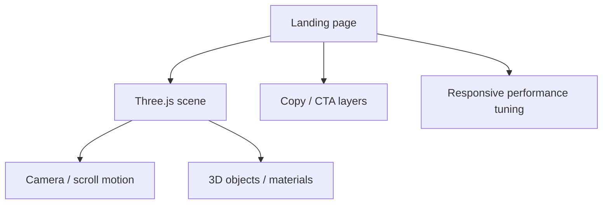

# 3d-landing

  
  
  
  
  

## English

**What it is:** 3d-landing is a public cinematic Three.js/WebGL landing page with scroll-driven 3D presentation, visual storytelling and performance-aware frontend structure.

**Problem it solves:** many portfolio/frontend projects look static and generic. This project demonstrates interactive product presentation, motion, hierarchy, rendering control and visual polish.

**Why it stands out:** 3d-landing is the visual proof in the portfolio. It shows that I can build not only backend systems and automations, but also memorable product presentation with 3D, motion, hierarchy, performance awareness and frontend taste.

**Strongest signals:** Three.js/WebGL, scroll-driven storytelling, animation loop, scene/UI separation, responsive polish, performance-aware rendering and product presentation.

**Stack:** JavaScript, Vite, Three.js/WebGL, responsive layout, scroll-driven composition, animation loop, lightweight frontend structure and performance-aware rendering choices.

**Architecture:** the 3D scene is separated from page composition and UI layers. This keeps the landing maintainable while still allowing immersive motion and product-facing presentation.

**Why this architecture:** Three.js projects become fragile when rendering, layout and copy are mixed together. Separating scene logic and UI composition makes the project easier to tune across devices.

**Why it is impressive:** 3d-landing adds visual range to the portfolio. It shows that the same engineer can build systems and also create polished, high-impact product experiences.

**Live/public proof:** [public repository](https://github.com/SamandarMansurkhodjaev2713/3d-landing)

## Русский

**Что это:** 3d-landing — публичный cinematic Three.js/WebGL landing с scroll-driven 3D presentation, визуальным storytelling и performance-aware frontend структурой.

**Какую проблему решает:** многие portfolio/frontend проекты выглядят статично и шаблонно. Этот проект показывает interactive product presentation, motion, hierarchy, rendering control и visual polish.

**Уникальность:** 3d-landing — визуальное доказательство в портфолио. Он показывает, что я могу делать не только backend systems и automations, но и запоминающуюся продуктовую подачу через 3D, motion, hierarchy, performance awareness и frontend taste.

**Сильнейшие стороны:** Three.js/WebGL, scroll-driven storytelling, animation loop, scene/UI separation, responsive polish, performance-aware rendering и product presentation.

**Стек:** JavaScript, Vite, Three.js/WebGL, responsive layout, scroll-driven composition, animation loop, lightweight frontend structure и performance-aware rendering choices.

**Архитектура:** 3D scene отделена от page composition и UI layers. Это позволяет сохранить проект поддерживаемым, но при этом сделать его визуально живым и product-facing.

**Почему именно так:** Three.js проекты быстро становятся хрупкими, если смешивать rendering, layout и copy. Разделение scene logic и UI composition помогает стабильнее дорабатывать лендинг под разные устройства.

**Что это доказывает работодателю:** 3d-landing добавляет визуальную широту портфолио. Он показывает, что я могу делать не только systems/backend/automation, но и сильную продуктовую подачу.

**Публичное доказательство:** [public repository](https://github.com/SamandarMansurkhodjaev2713/3d-landing)

---

[Deep case study](../case-studies/3d-landing.md) · [Back to gallery](README.md)
