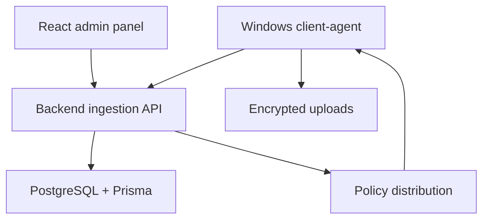

# BelfProctor

  
  
  
  
  

## English

**What it is:** BelfProctor is a private proctoring and workstation monitoring system with a Windows client-agent, backend ingestion API, database, admin panel and deployment package.

**Problem it solves:** real monitoring systems need more than a dashboard. They need installation, service behavior, heartbeat, event collection, secure uploads, retry logic, policy distribution, admin review and operational visibility.

**Stack:** C#/.NET Windows Service, Node.js, Express, TypeScript, PostgreSQL, Prisma, React, Vite, Refine, Ant Design, JWT, encrypted payloads, binary upload endpoints, Docker Compose and Windows deployment scripts.

**Architecture:** the Windows agent collects workstation-side signals and sends events, screenshots/reports and heartbeat data to the backend. The backend manages clients, auth, policies, uploads and reports. The admin panel works as an operational console.

**Why this architecture:** the client, backend, admin panel and deployment layer fail for different reasons. Separating them makes the system easier to debug, deploy, secure and extend on real Windows machines.

**Why it is impressive:** BelfProctor shows engineering outside the usual web app lane: client-agent behavior, sensitive telemetry, binary uploads, admin workflow, deployment packaging and privacy-aware documentation.

**Safe demo angle:** show anonymized architecture, agent/admin flow and deployment model without exposing monitoring data, customer infrastructure, internal policies, screenshots or secrets.

## Русский

**Что это:** BelfProctor — приватная система прокторинга и мониторинга рабочих станций. В ней есть Windows client-agent, backend ingestion API, база данных, admin panel и deployment-пакет для установки.

**Какую проблему решает:** настоящая monitoring/proctoring система — это не просто админка со скриншотами. Нужны установка, service behavior, heartbeat, события, защищённые загрузки, retry-логика, политики, отчёты и понятная админская наблюдаемость.

**Стек:** C#/.NET Windows Service, Node.js, Express, TypeScript, PostgreSQL, Prisma, React, Vite, Refine, Ant Design, JWT, encrypted payloads, binary upload endpoints, Docker Compose, Windows deployment scripts.

**Архитектура:** агент отвечает за сбор и отправку данных с рабочей станции. Backend принимает events, heartbeat, reports, screenshots и policies. Admin panel позволяет просматривать клиентов, отчёты, политики и состояние системы.

**Почему именно так:** агент, backend, admin panel и deployment ломаются по разным причинам. Разделение этих частей делает систему проще для отладки, безопасности, установки и расширения на реальных Windows-машинах.

**Что это доказывает работодателю:** проект показывает, что я могу работать не только с web UI, но и с клиентским агентом, sensitive telemetry, binary upload, backend ingestion, admin workflow и deployment-ограничениями.

**Безопасный формат показа:** можно показать обезличенную архитектуру, agent/admin flow и deployment story без мониторинговых данных, клиентской инфраструктуры, внутренних политик, скриншотов и секретов.

---

[Deep case study](../case-studies/belfproctor.md) · [Back to gallery](README.md)
