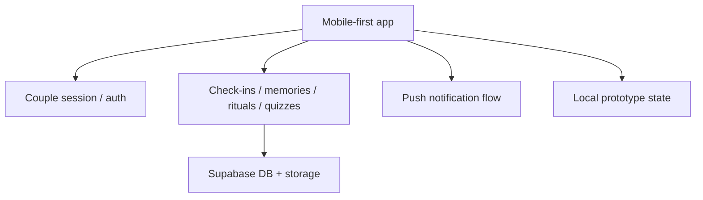

# CoupleOS

  
  
  
  
  

## English

**What it is:** CoupleOS is a private mobile-first product for couples: emotional check-ins, memories, private interactions, rituals, questions, quizzes and relationship comfort flows in one lightweight experience.

**Problem it solves:** relationship products must feel personal, safe and emotionally natural. They also need retention mechanics, privacy-aware data handling and fast mobile UX, otherwise the product becomes either too shallow or too heavy.

**Stack:** Next.js, React, TypeScript, Tailwind CSS, motion, mobile-first layout, Supabase auth/database/storage, PWA behavior, push-notification direction and Zod/env validation patterns.

**Architecture:** the product separates mobile UI flows, couple/session logic, feature modules, Supabase-backed persistence, push notifications and local prototype state. This keeps fast iteration possible without losing the path to production.

**Why this architecture:** consumer products need speed of iteration, but private relationship data cannot be treated casually. The architecture allows fast prototyping while preserving clear boundaries for auth, storage, notifications and sensitive product flows.

**Why it is impressive:** CoupleOS shows product taste: emotional UX, mobile-first design, privacy-aware architecture, consumer retention mechanics and founder-style thinking beyond pure engineering.

**Safe demo angle:** show the user journey, sanitized screens, feature map and product logic without exposing private user data, relationship content, Supabase credentials or unreleased business mechanics.

## Русский

**Что это:** CoupleOS — приватный mobile-first продукт для пар: emotional check-ins, memories, private interactions, rituals, questions, quizzes и relationship comfort flows в одном лёгком опыте.

**Какую проблему решает:** relationship-продукт должен ощущаться личным, безопасным и эмоционально естественным. При этом ему нужны retention mechanics, аккуратная работа с приватными данными и быстрый mobile UX, иначе продукт становится либо поверхностным, либо слишком тяжёлым.

**Стек:** Next.js, React, TypeScript, Tailwind CSS, motion, mobile-first layout, Supabase auth/database/storage, PWA behavior, направление push notifications, Zod/env validation patterns.

**Архитектура:** продукт разделяет mobile UI flows, couple/session logic, feature modules, Supabase-backed persistence, push notifications и local prototype state. Это позволяет быстро итерироваться, но не терять путь к production.

**Почему именно так:** consumer-продукту нужна скорость, но приватные relationship data нельзя обрабатывать хаотично. Поэтому auth, storage, notifications и sensitive product flows должны иметь понятные границы.

**Что это доказывает работодателю:** CoupleOS показывает вкус к продукту: эмоциональный UX, mobile-first дизайн, privacy-aware architecture, consumer retention mechanics и founder-style мышление за пределами чистой инженерии.

**Безопасный формат показа:** можно показать user journey, sanitized screens, feature map и product logic без private user data, relationship content, Supabase credentials и unreleased business mechanics.

---

[Deep case study](../case-studies/coupleos.md) · [Back to gallery](README.md)
