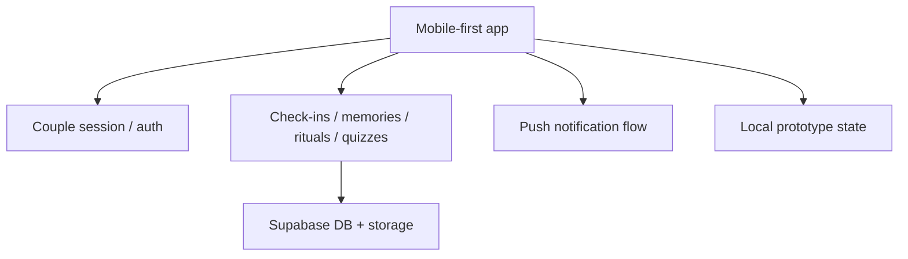

# CoupleOS / Softly

  
  
  
  
  
  
  

## English

**What it is:** CoupleOS / Softly is my founder-led mobile-first product for couples: emotional check-ins, memories, private interactions, rituals, questions, quizzes and relationship comfort flows in one lightweight experience.

**Problem it solves:** relationship products must feel personal, safe and emotionally natural. They also need retention mechanics, privacy-aware data handling and fast mobile UX, otherwise the product becomes either too shallow or too heavy.

**Live product:** [SoftlyLove.uz](https://softlylove.uz)

**My role:** Founder and product builder. I own the product direction, emotional UX, feature structure, technical implementation and launch positioning.

**Why it stands out:** Softly is strong because it sits at the intersection of product psychology, mobile UX, privacy and retention. It is not only a pretty relationship app: the challenge is to make a private emotional product feel safe, lightweight, habit-forming and technically ready to evolve.

**Strongest signals:** founder ownership, consumer product taste, emotional UX, mobile-first design, Supabase-backed architecture, privacy-aware data boundaries, PWA direction and retention mechanics.

**Stack:** Next.js, React, TypeScript, Tailwind CSS, motion, mobile-first layout, Supabase auth/database/storage, PWA behavior, push-notification direction and Zod/env validation patterns.

**Architecture:** the product separates mobile UI flows, couple/session logic, feature modules, Supabase-backed persistence, push notifications and local prototype state. This keeps fast iteration possible without losing the path to production.

**Why this architecture:** consumer products need speed of iteration, but private relationship data cannot be treated casually. The architecture allows fast prototyping while preserving clear boundaries for auth, storage, notifications and sensitive product flows.

**Why it is impressive:** CoupleOS / Softly shows product taste: emotional UX, mobile-first design, privacy-aware architecture, consumer retention mechanics, founder ownership and thinking beyond pure engineering.

**Safe demo angle:** show the user journey, sanitized screens, feature map and product logic without exposing private user data, relationship content, Supabase credentials or unreleased business mechanics.

## Русский

**Что это:** CoupleOS / Softly — мой founder-led mobile-first продукт для пар: emotional check-ins, memories, private interactions, rituals, questions, quizzes и relationship comfort flows в одном лёгком опыте.

**Какую проблему решает:** relationship-продукт должен ощущаться личным, безопасным и эмоционально естественным. При этом ему нужны retention mechanics, аккуратная работа с приватными данными и быстрый mobile UX, иначе продукт становится либо поверхностным, либо слишком тяжёлым.

**Live product:** [SoftlyLove.uz](https://softlylove.uz)

**Моя роль:** Founder и product builder. Я отвечаю за продуктовую идею, emotional UX, структуру фич, техническую реализацию и launch positioning.

**Уникальность:** Softly силён тем, что находится на стыке product psychology, mobile UX, privacy и retention. Это не просто красивое приложение для отношений: задача в том, чтобы личный эмоциональный продукт ощущался безопасным, лёгким, привычкообразующим и технически готовым к развитию.

**Сильнейшие стороны:** founder ownership, consumer product taste, emotional UX, mobile-first design, Supabase-backed architecture, privacy-aware data boundaries, PWA direction и retention mechanics.

**Стек:** Next.js, React, TypeScript, Tailwind CSS, motion, mobile-first layout, Supabase auth/database/storage, PWA behavior, направление push notifications, Zod/env validation patterns.

**Архитектура:** продукт разделяет mobile UI flows, couple/session logic, feature modules, Supabase-backed persistence, push notifications и local prototype state. Это позволяет быстро итерироваться, но не терять путь к production.

**Почему именно так:** consumer-продукту нужна скорость, но приватные relationship data нельзя обрабатывать хаотично. Поэтому auth, storage, notifications и sensitive product flows должны иметь понятные границы.

**Что это доказывает работодателю:** CoupleOS / Softly показывает вкус к продукту: эмоциональный UX, mobile-first дизайн, privacy-aware architecture, consumer retention mechanics, founder ownership и мышление за пределами чистой инженерии.

**Безопасный формат показа:** можно показать user journey, sanitized screens, feature map и product logic без private user data, relationship content, Supabase credentials и unreleased business mechanics.

---

[Live product](https://softlylove.uz) · [Deep case study](../case-studies/coupleos.md) · [Back to gallery](README.md)
