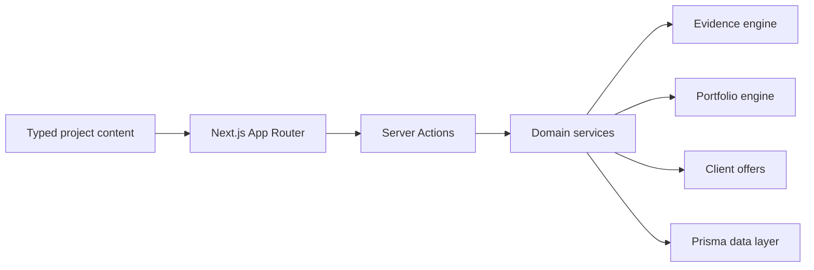

# Forge / Learning OS

  
  
  
  
  

## English

**What it is:** Forge is a project-first Learning OS for AI-native builders. Instead of measuring passive course progress, it helps a learner build real projects, attach evidence, pass quality gates, publish portfolio cases and turn results into client-ready offers.

**Problem it solves:** most learning platforms show weak proof: watched lessons, certificates and progress bars. Forge is designed around stronger proof: artifacts, verification, public case studies, portfolio export and commercial positioning.

**Stack:** Next.js 15 App Router, React 19, TypeScript strict, Tailwind CSS, shadcn/Radix UI, Framer Motion, Server Actions, Prisma, Auth.js, Zod, SQLite for local development with a Postgres-ready model, Vitest, Playwright and axe-oriented accessibility checks.

**Architecture:** content, progress, evidence, portfolio and client-offer logic are separated into clear layers. Server Actions stay thin and delegate business rules to services. Prisma models user progress, evidence, portfolio pages, proposals and product events.

**Why this architecture:** Forge combines learning, progress, evidence, public publishing and sales workflows. A layered architecture keeps the product expandable: new project tracks, quality gates, portfolio formats and proposal workflows can be added without rewriting the core.

**Why it is impressive:** this is the strongest founder/product-minded case. It shows product architecture, domain modeling, UX thinking, full-stack implementation, testing mindset and the ability to turn learning into market-facing proof.

**Safe demo angle:** show the product flow, README/case study, architecture, tests and sanitized screens without exposing `.env`, local database, user data or private product logic.

## Русский

**Что это:** Forge / Learning OS — личный продукт для AI-native обучения через реальные проекты. Пользователь не просто смотрит уроки, а строит продукты, прикладывает evidence, проходит quality gates, собирает портфолио и превращает результат в клиентское предложение.

**Какую проблему решает:** обычные образовательные платформы часто показывают слабые метрики: просмотренные уроки, сертификаты и проценты прогресса. Forge делает акцент на доказательствах навыка: артефакты, проверки, кейсы, портфолио и коммерческая упаковка результата.

**Стек:** Next.js 15 App Router, React 19, TypeScript strict, Tailwind CSS, shadcn/Radix UI, Framer Motion, Server Actions, Prisma, Auth.js, Zod, SQLite для локальной разработки с готовностью к Postgres, Vitest, Playwright, accessibility checks.

**Архитектура:** проект разделён на typed content, UI, server actions, domain services, Prisma data layer, evidence engine, portfolio engine и client-offer workflow. UI не содержит бизнес-логику, server actions остаются тонкими, а ключевые правила живут в сервисном слое.

**Почему именно так:** продукт объединяет несколько сложных контуров: обучение, прогресс, evidence, публичные кейсы, экспорт, клиентские офферы и админские сценарии. Если смешать это в одном UI/backend слое, проект быстро станет неподдерживаемым. Разделение слоёв делает систему понятной, тестируемой и готовой к росту.

**Что это доказывает работодателю:** это сильный founder/product-minded кейс. Он показывает, что я умею не только писать код, но и проектировать продукт: доменную модель, UX, backend, data layer, тестирование, публичный результат и бизнес-ценность.

**Безопасный формат показа:** можно показывать архитектуру, README, case study, тесты, sanitized screens и пользовательский flow без публикации приватного кода, `.env`, локальной базы и внутренних product-механик.

---

[Deep case study](../case-studies/forge-learning-os.md) · [Back to gallery](README.md)
