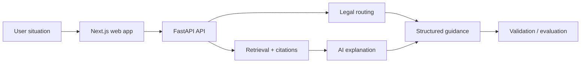

# Klawis

  
  
  
  
  

## English

**What it is:** Klawis is a legal AI navigator for Uzbekistan that turns a user situation into structured legal direction: likely legal area, jurisdiction, next steps, documents, deadlines and source-backed explanation.

**Problem it solves:** legal questions are ambiguous for non-lawyers, and generic AI answers are not enough when accuracy, jurisdiction and citations matter. Klawis is designed to be traceable, not just conversational.

**Stack:** Python 3.12, FastAPI, Pydantic, Next.js, React, TypeScript, Tailwind CSS, Supabase/PostgreSQL, pgvector, Drizzle, RAG, provider abstraction for OpenAI/Gemini-style models, pytest, Vitest and Playwright-style checks.

**Architecture:** deterministic legal routing is separated from retrieval and AI explanation. The response is structured, citation-oriented and designed for validation/evaluation.

**Why this architecture:** for legal-tech, a plain chatbot is risky. Deterministic routing improves structure, retrieval grounds answers in sources, and the AI layer turns the result into user-friendly explanation without becoming the only source of truth.

**Why it is impressive:** Klawis shows applied AI beyond prompt engineering: domain routing, RAG, citations, validation mindset, sensitive-domain UX and full-stack product delivery.

**Safe demo angle:** show the product flow, sample anonymized questions, architecture and citation behavior without publishing legal datasets, internal prompts, private corpus processing or sensitive user data.

## Русский

**Что это:** Klawis — legal AI navigator для Узбекистана. Пользователь описывает ситуацию, а система помогает понять правовое направление: категорию, возможную юрисдикцию, следующие шаги, документы, сроки и объяснение с источниками.

**Какую проблему решает:** обычному человеку сложно понять, к какой области права относится ситуация, куда обращаться и какие документы нужны. Обычный AI-chatbot здесь недостаточен, потому что в юридическом домене важны точность, юрисдикция, проверяемость и цитирование.

**Стек:** Python 3.12, FastAPI, Pydantic, Next.js, React, TypeScript, Tailwind CSS, Supabase/PostgreSQL, pgvector, Drizzle, RAG, provider abstraction для OpenAI/Gemini-style моделей, pytest, Vitest, Playwright-style checks.

**Архитектура:** deterministic legal routing отделён от retrieval/citations и AI explanation layer. Система сначала структурирует ситуацию и правовой маршрут, затем использует источники и AI-объяснение, а результат остаётся проверяемым.

**Почему именно так:** в legal-tech нельзя строить продукт как “LLM ответил красиво”. Нужны правила, источники, цитирование, валидация и осторожный UX. Разделение routing, RAG и explanation снижает риск галлюцинаций и делает продукт более надёжным.

**Что это доказывает работодателю:** Klawis показывает прикладной AI на уровне продукта: RAG, citation discipline, domain logic, full-stack delivery и понимание чувствительного домена.

**Безопасный формат показа:** можно показать flow, обезличенные примеры, архитектуру и поведение с цитатами без публикации приватного корпуса, внутренних промптов, пользовательских данных и бизнес-логики.

---

[Deep case study](../case-studies/klawis.md) · [Back to gallery](README.md)
