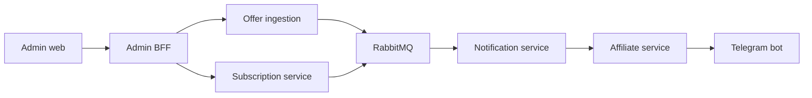

# Marketbot

  
  
  
  
  

## English

**What it is:** Marketbot is a private e-commerce automation platform for collecting product offers, managing subscriptions, generating affiliate links and sending Telegram notifications.

**Problem it solves:** offer-based products need ingestion, normalization, filters, subscriptions, delivery, affiliate logic, admin visibility and failure handling. A single uncontrolled script becomes hard to debug and evolve.

**Why it stands out:** Marketbot is a strong backend/commercial automation case because it models a business workflow as services and events. It covers the full loop: offer ingestion, subscription logic, affiliate processing, notification delivery, admin visibility and failure isolation.

**Strongest signals:** event-driven architecture, gRPC/protobuf contracts, RabbitMQ flows, service boundaries, commerce automation, Telegram delivery, admin BFF and operational debugging.

**Stack:** Python 3.12, uv workspace, gRPC/protobuf contracts, RabbitMQ, PostgreSQL per service, Redis, React, Vite, TypeScript, TanStack Query, Zod, Docker Compose, Traefik, pytest, Vitest and buf.

**Architecture:** the platform is split into offer ingestion, subscription, notification, affiliate, Telegram bot and admin BFF services. gRPC handles service contracts, while RabbitMQ carries event-driven updates.

**Why this architecture:** ingestion, subscriptions, affiliate logic and notification delivery change for different reasons. Separating them reduces coupling and makes failures easier to isolate.

**Why it is impressive:** Marketbot shows event-driven backend design, service contracts, commerce workflow automation, Telegram delivery and admin/operations thinking.

**Safe demo angle:** show architecture, service map, admin flow and anonymized notifications without exposing source data, affiliate configuration, user subscriptions or credentials.

## Русский

**Что это:** Marketbot — приватная e-commerce automation платформа для сбора офферов, управления подписками, генерации affiliate links и отправки Telegram-уведомлений.

**Какую проблему решает:** offer-based продукты требуют ingestion, normalization, filters, subscriptions, delivery, affiliate logic, admin visibility и failure handling. Один большой скрипт быстро становится неподдерживаемым.

**Уникальность:** Marketbot — сильный backend/commercial automation кейс, потому что бизнес-процесс представлен как набор сервисов и событий. Проект закрывает полный цикл: offer ingestion, subscription logic, affiliate processing, notification delivery, admin visibility и failure isolation.

**Сильнейшие стороны:** event-driven architecture, gRPC/protobuf contracts, RabbitMQ flows, service boundaries, commerce automation, Telegram delivery, admin BFF и operational debugging.

**Стек:** Python 3.12, uv workspace, gRPC/protobuf contracts, RabbitMQ, PostgreSQL per service, Redis, React, Vite, TypeScript, TanStack Query, Zod, Docker Compose, Traefik, pytest, Vitest, buf.

**Архитектура:** платформа разделена на offer ingestion, subscription, notification, affiliate, Telegram bot и admin BFF. gRPC отвечает за service contracts, RabbitMQ — за event-driven обновления.

**Почему именно так:** ingestion, подписки, affiliate logic и notification delivery меняются по разным причинам. Разделение сервисов снижает связанность и помогает быстрее находить сбои.

**Что это доказывает работодателю:** проект показывает event-driven backend design, service contracts, e-commerce automation, Telegram delivery и operational/admin мышление.

**Безопасный формат показа:** можно показать архитектуру, service map, admin flow и обезличенные уведомления без source data, affiliate config, user subscriptions и credentials.

---

[Deep case study](../case-studies/marketbot.md) · [Back to gallery](README.md)
