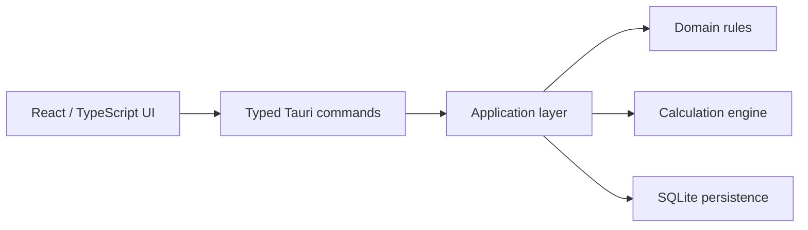

# med-exe

  
  
  
  
  

## English

**What it is:** med-exe is a private offline Windows desktop application for cardiometabolic risk calculation and patient profile management.

**Problem it solves:** clinical and research tools need deterministic logic, reproducibility and privacy-aware local execution. A web-only product can be inappropriate when sensitive data should remain on the machine.

**Why it stands out:** med-exe is strong because it treats sensitive calculation software as a real product, not a quick form. The architecture separates UI, typed desktop IPC, Rust domain logic, local persistence and privacy boundaries, which is exactly what matters in medical-style tooling.

**Strongest signals:** Rust/Tauri desktop architecture, deterministic domain logic, local-first privacy, typed boundaries, SQLite persistence, testing/formatting discipline and separation between UX and sensitive calculations.

**Stack:** Tauri 2, Rust workspace, React, TypeScript, Vite, SQLite, typed IPC boundaries, Zod/typed validation, Rust tests, clippy, rustfmt, frontend tests and typecheck.

**Architecture:** the UI communicates with the Rust core through typed Tauri commands. Calculation logic lives in the domain/calculation engine, while persistence is handled separately through SQLite.

**Why this architecture:** medical-style calculation logic must be stable and testable. Separating UI from domain rules reduces the risk that interface changes affect sensitive calculations.

**Why it is impressive:** med-exe shows desktop architecture, Rust domain modeling, local-first privacy, deterministic calculation boundaries and product thinking for sensitive data.

**Safe demo angle:** show architecture, anonymized screens and calculation workflow without publishing patient data, private formulas that should remain closed or local databases.

## Русский

**Что это:** med-exe — приватное offline Windows desktop application для расчёта cardiometabolic risk и управления patient profiles.

**Какую проблему решает:** медицинские и research-инструменты требуют deterministic logic, reproducibility и privacy-aware локального запуска. Web-only архитектура не всегда подходит, если sensitive data должны оставаться на устройстве.

**Уникальность:** med-exe силён тем, что относится к sensitive calculation software как к настоящему продукту, а не как к быстрой форме. Архитектура разделяет UI, typed desktop IPC, Rust domain logic, local persistence и privacy boundaries — именно это важно в medical-style tooling.

**Сильнейшие стороны:** Rust/Tauri desktop architecture, deterministic domain logic, local-first privacy, typed boundaries, SQLite persistence, testing/formatting discipline и разделение UX от чувствительных вычислений.

**Стек:** Tauri 2, Rust workspace, React, TypeScript, Vite, SQLite, typed IPC boundaries, Zod/typed validation, Rust tests, clippy, rustfmt, frontend tests и typecheck.

**Архитектура:** UI общается с Rust core через typed Tauri commands. Расчётная логика живёт в domain/calculation engine, persistence вынесен отдельно через SQLite.

**Почему именно так:** расчётная логика в medical-style продукте должна быть стабильной и тестируемой. Разделение UI и domain engine снижает риск, что изменения интерфейса случайно повлияют на чувствительные вычисления.

**Что это доказывает работодателю:** проект показывает desktop architecture, Rust domain modeling, offline-first privacy, deterministic calculation boundaries и аккуратную работу с sensitive data.

**Безопасный формат показа:** можно показать архитектуру, обезличенные экраны и calculation workflow без patient data, приватных формул, если их нельзя раскрывать, и локальных баз.

---

[Deep case study](../case-studies/med-exe.md) · [Back to gallery](README.md)
