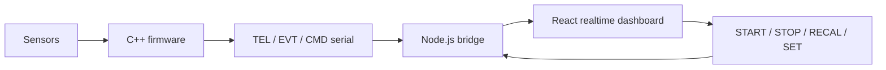

# Sentinel Edge / smart-system

  
  
  
  
  

## English

**What it is:** Sentinel Edge is a public local smart-environment monitoring prototype built around Arduino-style firmware, a compact serial protocol, a Node.js bridge and a React/Vite realtime operator dashboard.

**Problem it solves:** many embedded demos stop at raw sensor values. Sentinel Edge adds adaptive baselines, anomaly scoring, finite-state machine states, explainable events and a real dashboard without pretending to be heavyweight cloud AI.

**Stack:** Arduino-style C++ for UNO-class devices, serial `TEL`/`EVT`/`CMD` protocol, Node.js, `serialport`, `ws`, React 19, Vite, TypeScript, Tailwind CSS, Framer Motion, Zustand, uPlot and detailed product/QA/deployment docs.

**Architecture:** firmware handles sensors, signal processing, baselines, anomaly scoring, FSM decisions and protocol output. The Node bridge isolates serial transport from the browser. The dashboard focuses on realtime visualization and controls.

**Why this architecture:** the design respects embedded constraints. Firmware stays deterministic and compact, the protocol stays MCU-friendly, the bridge owns hardware access, and the dashboard stays responsive and user-facing.

**Why it is impressive:** Sentinel Edge shows breadth: embedded systems, protocol design, realtime UI, dashboard state management, documentation and honest edge-intelligence thinking.

**Live/public proof:** [public repository](https://github.com/SamandarMansurkhodjaev2713/sentinel-edge-smart-system)

## Русский

**Что это:** Sentinel Edge / smart-system — публичный проект на стыке embedded и full-stack: Arduino-style прошивка, serial protocol, Node.js bridge и React/Vite realtime dashboard.

**Какую проблему решает:** многие embedded-демо заканчиваются выводом значений датчиков. Здесь есть adaptive baseline, anomaly scoring, FSM states, explainable events и полноценная operator console без фейкового заявления про “большой AI”.

**Стек:** Arduino-style C++ для UNO-class devices, serial protocol `TEL`/`EVT`/`CMD`, Node.js, `serialport`, `ws`, React 19, Vite, TypeScript, Tailwind CSS, Framer Motion, Zustand, uPlot, подробная документация по продукту, архитектуре, QA и демо.

**Архитектура:** firmware отвечает за датчики, signal processing, baseline, anomaly scoring, FSM, decisions и protocol output. Node bridge отделяет serial transport от браузера. Dashboard показывает realtime данные, события, состояние системы и controls.

**Почему именно так:** архитектура учитывает ограничения embedded. Прошивка остаётся детерминированной, protocol компактным, bridge изолирует доступ к hardware, а dashboard отвечает за визуализацию и UX.

**Что это доказывает работодателю:** проект показывает широту: C++/embedded, protocol design, Node bridge, realtime frontend, state management и аккуратную документацию. Это сильный сигнал, что я могу соединять hardware, backend и frontend в одну систему.

**Публичное доказательство:** [public repository](https://github.com/SamandarMansurkhodjaev2713/sentinel-edge-smart-system)

---

[Deep case study](../case-studies/sentinel-edge.md) · [Back to gallery](README.md)
