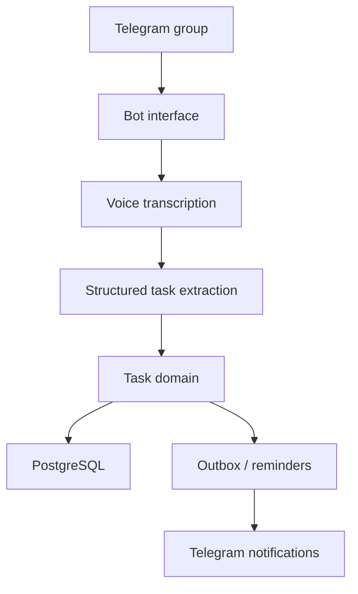

# Task-manager / Task Manage Bot

  
  
  
  
  

## English

**What it is:** Task-manager / Task Manage Bot represents a Telegram automation direction: a public Rust bot repository plus a private AI-powered workflow bot that turns chat and voice activity into structured tasks, reminders and operational follow-ups.

**Problem it solves:** teams often create tasks informally in chats and voice messages. Without assignment, deadlines, reminders and review loops, important work disappears inside conversation history.

**Why it stands out:** this project is strong because it turns messy human communication into a managed operational loop. It is not only a Telegram bot: it combines transcription, structured extraction, task domain logic, reminders, queues/outbox, retries and team-facing reliability patterns.

**Strongest signals:** practical AI automation, voice-to-task flow, structured outputs, reminder/outbox patterns, bot UX, idempotency, clean architecture and public/private proof in the same direction.

**Stack:** Rust/Teloxide/SQLx/Docker for the public task-manager direction; Python 3.12, aiogram 3, OpenAI transcription/structured outputs, PostgreSQL, SQLAlchemy async, Alembic, queues/outbox, retries, pytest, mypy, ruff and Docker Compose for the private bot case.

**Architecture:** the bot interface is separated from transcription, structured parsing, task domain logic, persistence and reminders. Background work uses outbox/retry patterns so the bot can remain responsive.

**Why this architecture:** Telegram bots are easy to prototype and easy to break. Separating domain logic, external AI calls, persistence and reminders makes the system testable, reliable and ready for real team operations.

**Why it is impressive:** this project shows practical AI automation: converting messy human communication into structured workflow with reminders, retries, idempotency and clean architecture.

**Live/public proof:** [public Task-manager repository](https://github.com/SamandarMansurkhodjaev2713/Task-manager)

## Русский

**Что это:** Task-manager / Task Manage Bot — направление Telegram automation. С одной стороны есть публичный Rust task-manager, с другой — приватный AI-powered bot, который превращает сообщения и голосовые в задачи, напоминания и operational workflow.

**Какую проблему решает:** в командах задачи часто рождаются в чатах и голосовых. Без назначения, сроков, напоминаний и review loop они теряются в истории сообщений.

**Уникальность:** проект силён тем, что превращает хаотичную человеческую коммуникацию в управляемый operational loop. Это не просто Telegram bot: здесь есть transcription, structured extraction, task domain logic, reminders, queues/outbox, retries и reliability patterns для командной работы.

**Сильнейшие стороны:** practical AI automation, voice-to-task flow, structured outputs, reminder/outbox patterns, bot UX, idempotency, clean architecture и связка public/private proof в одном направлении.

**Стек:** Rust/Teloxide/SQLx/Docker для публичного направления Task-manager; Python 3.12, aiogram 3, OpenAI transcription/structured outputs, PostgreSQL, SQLAlchemy async, Alembic, queues/outbox, retries, pytest, mypy, ruff, Docker Compose для приватного bot case.

**Архитектура:** bot interface отделён от transcription, structured parsing, task domain logic, persistence и reminders. Фоновые задачи проходят через outbox/retry-паттерны, чтобы бот оставался отзывчивым и не терял операции.

**Почему именно так:** Telegram bot легко сделать прототипом, но сложно сделать надёжным. Разделение domain logic, AI calls, persistence и reminders делает систему тестируемой, устойчивой и пригодной для реальной командной работы.

**Что это доказывает работодателю:** проект показывает практическую AI automation: превращение неструктурированной коммуникации в operational workflow с reminders, retries, idempotency и clean architecture.

**Публичное доказательство:** [public Task-manager repository](https://github.com/SamandarMansurkhodjaev2713/Task-manager)

---

[Deep case study](../case-studies/task-manage-bot.md) · [Back to gallery](README.md)
