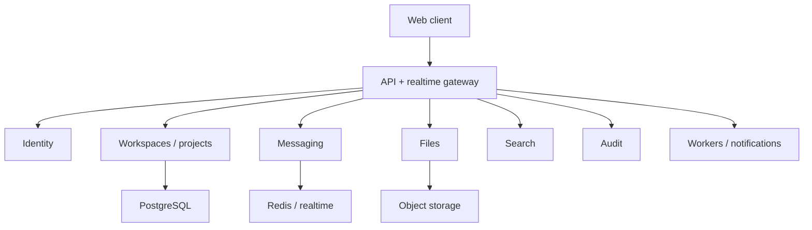

# TTYL Platform

  
  
  
  
  

## English

**What it is:** TTYL Platform is a private self-hosted collaboration platform for teams that need projects, chat, files, search, notifications and auditability inside a controlled environment.

**Problem it solves:** some organizations need modern collaboration UX but cannot move internal communication, files and operational data into external SaaS tools. The platform is positioned around on-premise control, privacy and explicit infrastructure ownership.

**Why it stands out:** TTYL is strong because it combines product UX and infrastructure thinking. It is not only a task board or chat clone: it treats identity, permissions, files, realtime, search, audit logs, notifications and deployment as first-class parts of one controlled enterprise system.

**Strongest signals:** enterprise system design, on-prem readiness, data ownership, service/domain boundaries, realtime collaboration, object storage, queues/workers, auditability and operational thinking.

**Stack:** NestJS, Fastify, Prisma, Next.js, React, TypeScript, Tailwind CSS, Radix UI, TanStack tools, PostgreSQL, Redis, MinIO, BullMQ/workers, WebSocket realtime gateway, Docker, Nginx and observability-oriented infrastructure.

**Architecture:** the system is split by domains: identity, workspace/project management, messaging, files, search, notifications, audit and realtime. Storage, queues and realtime concerns are explicit rather than hidden inside one monolithic feature.

**Why this architecture:** collaboration platforms have several different failure modes: permissions, realtime delivery, file uploads, search, notifications and audit logs. Separating these domains makes the system easier to secure, test, deploy and reason about.

**Why it is impressive:** TTYL shows enterprise-grade full-stack/system-design thinking: on-prem deployment, data control, service boundaries, typed contracts, realtime UX, files, queues and auditability.

**Safe demo angle:** show architecture, screens, deployment story and anonymized workflows without exposing customer names, private deployment details or internal data.

## Русский

**Что это:** TTYL Platform — приватная self-hosted платформа для командной работы: проекты, задачи, чаты, файлы, поиск, уведомления и audit logs в контролируемой инфраструктуре.

**Какую проблему решает:** не каждая компания может или хочет переносить внутренние данные, файлы и коммуникацию во внешний SaaS. TTYL закрывает потребность в современной collaboration-платформе с on-prem подходом, контролем данных и понятной инфраструктурой.

**Уникальность:** TTYL силён тем, что объединяет product UX и infrastructure thinking. Это не просто task board или чат-клон: identity, permissions, files, realtime, search, audit logs, notifications и deployment рассматриваются как полноценные части одной enterprise-системы.

**Сильнейшие стороны:** enterprise system design, on-prem readiness, контроль данных, service/domain boundaries, realtime collaboration, object storage, очереди/workers, auditability и операционное мышление.

**Стек:** NestJS, Fastify, Prisma, Next.js, React, TypeScript, Tailwind CSS, Radix UI, TanStack tools, PostgreSQL, Redis, MinIO, BullMQ/workers, WebSocket gateway, Docker, Nginx, observability-инфраструктура.

**Архитектура:** система разделена по доменам: identity, workspace/project management, messaging, files, search, notifications, audit и realtime. Файлы, очереди, realtime и audit не спрятаны внутри одной большой фичи, а вынесены как отдельные архитектурные контуры.

**Почему именно так:** collaboration-платформа ломается в разных местах: права доступа, realtime, загрузка файлов, поиск, уведомления, аудит. Разделение доменов делает проект проще для безопасности, тестирования, деплоя и масштабирования.

**Что это доказывает работодателю:** это сильный enterprise/system-design кейс. Он показывает, что я понимаю не только CRUD и UI, но и on-prem, права доступа, realtime, storage, очереди, аудит, деплой и эксплуатацию продукта.

**Безопасный формат показа:** можно показывать архитектуру, product flow, экраны и deployment story без названий клиентов, приватной инфраструктуры и внутренних данных.

---

[Deep case study](../case-studies/ttyl-platform.md) · [Back to gallery](README.md)
