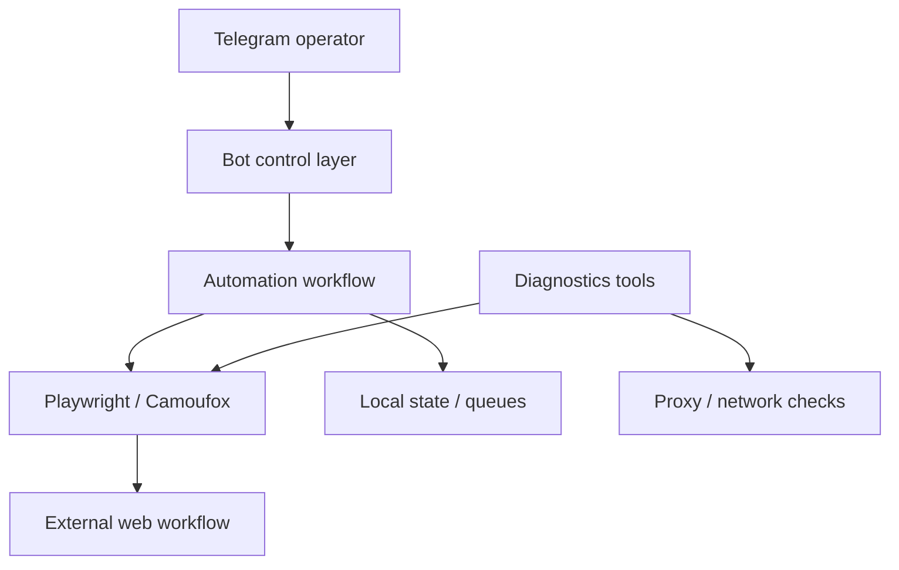

# VFS Killer Main

  
  
  
  
  

## English

**What it is:** VFS Killer Main is a private browser-automation system for a high-friction external workflow. It combines Playwright/Camoufox-style browser control, Telegram operator commands, runtime configuration and diagnostics tools.

**Problem it solves:** real browser workflows fail because of sessions, timing, network/proxy instability, external-state changes and anti-automation friction. A one-file script is not enough for this class of work.

**Why it stands out:** VFS Killer Main shows automation in the real world, where the hard part is not clicking buttons but surviving unreliable external state. The project is valuable because it includes operator control, diagnostics, environment checks, state boundaries and recovery thinking.

**Strongest signals:** browser automation under unstable constraints, diagnostics-first design, Telegram control surface, Docker runtime, proxy/network awareness, retry mindset and practical debugging experience.

**Stack:** Python, Playwright/Camoufox-style browser automation, aiogram/Telegram bot workflows, local configuration and state boundaries, Docker, Docker Compose, endpoint/proxy/connection/parsing diagnostics.

**Architecture:** the Telegram interface is separated from the automation workflow, browser layer, local state and diagnostics. Diagnostics are treated as part of the product because external workflows often fail outside the application code.

**Why this architecture:** browser automation in unstable external systems needs observability, recovery and manual control. Separating bot, workflow, browser, diagnostics and config avoids turning the project into a fragile happy-path script.

**Why it is impressive:** it demonstrates practical automation under real-world constraints: timing, retries, diagnostics, Docker runtime, external-state failures and operator UX.

**Safe demo angle:** show architecture, sanitized logs, diagnostics flow and bot command model without exposing accounts, proxy data, browser traces, external targets or secrets.

## Русский

**Что это:** VFS Killer Main — приватная browser-automation система для сложного внешнего workflow. Она объединяет Playwright/Camoufox-style browser control, Telegram-управление, конфигурацию, локальное состояние и diagnostic tools.

**Какую проблему решает:** реальные browser workflows часто ломаются из-за сессий, таймингов, сети, прокси, внешнего состояния и anti-automation friction. Для этого недостаточно одного скрипта на happy path.

**Уникальность:** VFS Killer Main показывает автоматизацию в реальном мире, где сложность не в “нажать кнопки”, а в том, чтобы выдержать нестабильное внешнее состояние. Сильная часть проекта — operator control, diagnostics, environment checks, state boundaries и recovery thinking.

**Сильнейшие стороны:** browser automation в нестабильных условиях, diagnostics-first design, Telegram control surface, Docker runtime, proxy/network awareness, retry mindset и практический опыт отладки.

**Стек:** Python, Playwright/Camoufox-style automation, aiogram/Telegram bot workflows, local config/state, Docker, Docker Compose, diagnostics для endpoint/proxy/connection/parsing.

**Архитектура:** Telegram interface отделён от workflow engine, browser layer, local state и diagnostics. Диагностика вынесена как отдельная часть системы, потому что проблемы часто возникают не в коде, а во внешнем состоянии, сети или браузерном окружении.

**Почему именно так:** нестабильная browser automation требует наблюдаемости, восстановления и ручного контроля. Разделение bot, workflow, browser, diagnostics и config делает систему устойчивее и проще для отладки.

**Что это доказывает работодателю:** проект показывает реальную automation-инженерию: retry-мышление, диагностику, Docker runtime, работу с нестабильной внешней средой и operator UX.

**Безопасный формат показа:** можно показать архитектуру, обезличенные логи, diagnostic flow и модель команд бота без аккаунтов, proxy data, browser traces, внешних целей и секретов.

---

[Deep case study](../case-studies/vfs-killer-main.md) · [Back to gallery](README.md)
