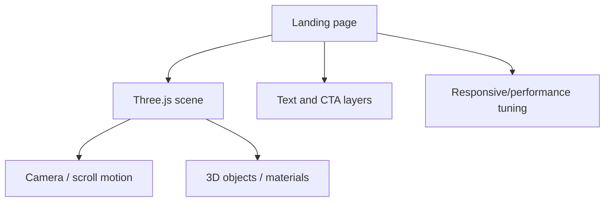

# 3d-landing

**Domain:** creative frontend / WebGL 
**Type:** public project repository 
**Role:** frontend engineering, 3D scene composition, interaction design, performance-aware UI 
**Repository:** [3d-landing](https://github.com/SamandarMansurkhodjaev2713/3d-landing)

## Summary

3d-landing is a cinematic Three.js/WebGL landing page with scroll-driven 3D presentation and adaptive performance thinking.

The project exists as a visual frontend proof: it shows that I can build not only operational dashboards and backend systems, but also polished, interactive product-facing experiences.

## Problem

Portfolio/frontend projects often become static pages. A strong landing needs motion, hierarchy, responsiveness, rendering control and a sense of product presentation.

The challenge is to make a landing page feel immersive without turning it into a heavy, fragile visual experiment.

## Stack

- **Frontend:** JavaScript, Vite
- **3D:** Three.js / WebGL
- **UI:** responsive layout, scroll-driven composition
- **Performance:** adaptive rendering choices and lightweight frontend structure

## Architecture

The project separates the visual scene from the page composition so the landing can remain maintainable while still feeling interactive.

## Why This Architecture

Three.js projects can easily become hard to control if rendering, layout and copy are mixed together. Keeping the scene logic and UI composition separate makes iteration easier and keeps the landing more stable across devices.

## What It Demonstrates

- WebGL/Three.js frontend engineering
- Visual storytelling
- Scroll-driven interaction
- Performance-aware frontend work
- Ability to make products feel polished, not only functional

## Русское описание

3d-landing — публичный визуальный frontend-проект на Three.js/WebGL. Он показывает, что я могу делать не только backend, dashboards и automation, но и сильную продуктовую подачу: 3D-сцену, scroll-driven experience, motion и аккуратный frontend polish.

**Почему это сильный кейс:** для работодателя это сигнал, что я умею работать с визуальной частью продукта и могу делать интерфейсы, которые выглядят современно, интерактивно и не как шаблонная страница.
