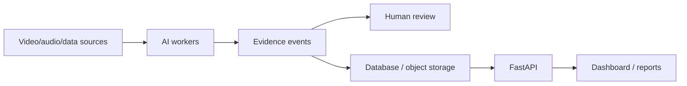

# AI Classroom

**Domain:** education analytics / applied AI  
**Type:** private AI platform  
**Role:** AI system design, backend architecture, evidence model, privacy-first product thinking

## Summary

AI Classroom is an evidence-based classroom intelligence platform. Instead of producing one vague “AI score”, the system is designed around traceable evidence events: timestamp, source, confidence, data quality and human review status.

## Problem

Educational environments are sensitive. A useful classroom analytics system must avoid becoming a black box. It needs:

- local/private processing options;
- explainable observations;
- confidence and quality tracking;
- human review;
- reproducible event history.

## Stack

- **Backend/Core:** Python 3.12, Pydantic v2
- **API:** FastAPI
- **Data:** SQLAlchemy, Alembic, PostgreSQL/SQLite
- **Workers:** Redis/RQ style background jobs
- **Infra:** Docker Compose
- **AI direction:** video/audio workers, detection/tracking/ASR/VLM pipeline, model registry

## Architecture

The code follows Clean Architecture principles:

- `domain` for models and rules;
- `application` for use cases and orchestration;
- `infrastructure` for database, queues and integrations;
- `interfaces` for HTTP/CLI.

## Why This Architecture

AI systems for real-world environments need traceability. The architecture keeps AI outputs as evidence, not as unquestioned truth. This makes the system more trustworthy, debuggable and suitable for privacy-sensitive contexts.

## What It Demonstrates

- Production-oriented AI system thinking
- Evidence, review and data-quality modeling
- Clean backend architecture
- Privacy-first design
- Ability to build AI products beyond a simple chat UI
