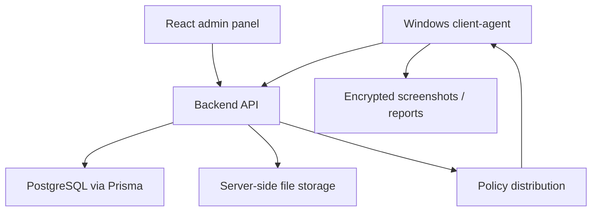

# BelfProctor

**Domain:** proctoring / workstation monitoring  
**Type:** private commercial system  
**Role:** client-agent architecture, backend/API design, admin workflow, deployment packaging

## Summary

BelfProctor is a private proctoring and workstation monitoring system built around three parts:

- a Windows client-agent installed as a service;
- a backend API for receiving events, heartbeats, screenshots, reports and policy data;
- an admin panel for reviewing clients, telemetry, reports, policies and system state.

The project is private because it handles sensitive monitoring data, deployment configuration and customer-specific infrastructure.

## Problem

Proctoring systems are not just dashboards. They need a reliable client-agent, secure transport, policy distribution, offline/retry behavior, admin visibility and a deployment model that works on real Windows machines, including older environments.

The core challenge is to make the system operationally usable: agents should install cleanly, send data reliably, recover after network failures and give administrators enough visibility without exposing sensitive internals.

## Stack

- **Client-agent:** C#, .NET, Windows Service
- **Backend:** Node.js, Express, TypeScript
- **Database:** PostgreSQL, Prisma
- **Frontend/admin:** React, Vite, Refine, Ant Design
- **Transport/security:** JWT auth, encrypted payloads, binary upload endpoints
- **Infra/deployment:** Docker Compose, Windows deployment scripts, service install scripts
- **Quality signals:** unit/integration/system tests around client behavior and policies

## Architecture

The client-agent is responsible for workstation-side collection and delivery. The backend separates auth, clients, events, heartbeat, screenshots, reports and policy routes. The admin panel consumes the API as an operational console rather than being a static report page.

## Why This Architecture

The architecture separates concerns that fail for different reasons:

- the client-agent needs stability on Windows machines;
- the backend needs secure ingestion and storage;
- the admin panel needs fast filtering and review workflows;
- deployment needs repeatable scripts for server and client installation.

This keeps the system easier to debug, deploy and extend. It also makes the project more realistic than a simple proof-of-concept because it includes service installation, encrypted telemetry, admin review and operational packaging.

## What It Demonstrates

- Windows service/client-agent development
- Full-stack proctoring platform architecture
- Secure telemetry and binary upload workflows
- Admin panel and operational UX
- Deployment packaging for real machines
- Privacy-aware public presentation without exposing sensitive monitoring data

## Русское описание

BelfProctor — приватная система прокторинга и мониторинга рабочих станций. В ней есть клиент-агент для Windows, backend API, база данных, админ-панель и deployment-пакет для установки на сервер и клиентские машины.

Главная инженерная ценность проекта в том, что это не просто “админка со скриншотами”, а полноценная система с агентом, heartbeat, событиями, политиками, отчётами, защищённой передачей данных и установкой как Windows service.

**Почему это выглядит сильно для работодателя:** проект показывает, что я могу работать не только с веб-интерфейсами, но и с системным клиентом, backend ingestion, безопасностью, deployment-скриптами, тестами и реальными ограничениями коммерческой инфраструктуры.
