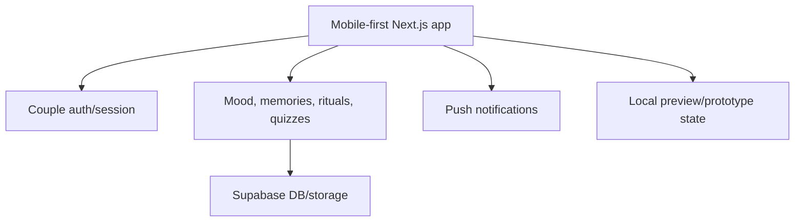

# CoupleOS / Softly

**Domain:** consumer relationship product  
**Type:** private product / PWA  
**Role:** founder, product design, frontend architecture, Supabase integration, mobile-first UX
**Live:** [SoftlyLove.uz](https://softlylove.uz)

## Summary

CoupleOS / Softly is my founder-led mobile-first product for couples focused on emotional check-ins, memories, private interactions, rituals, questions, quizzes and relationship comfort flows.

The product direction combines emotional UX with private data handling, realtime/product mechanics and a founder-style attempt to turn a sensitive emotional domain into a clean, usable and habit-forming product.

Unlike a simple "cute app" concept, Softly is designed around a difficult product problem: relationship products must feel personal and safe while still being technically structured enough to support auth, storage, notifications, retention loops and future feature growth.

## Problem

Consumer products in this category need to feel personal and lightweight while still being reliable and private. The challenge is to build an experience that is emotional, fast and safe without turning the codebase into a prototype-only mess.

## Stack

- **Frontend:** Next.js, React, TypeScript
- **Styling/UX:** Tailwind CSS, motion, mobile-first layout
- **Backend:** Supabase auth/database/storage
- **PWA:** push notifications, installable/mobile behavior
- **Validation:** Zod/env validation style patterns

## Architecture

The project separates prototype/local flows from production Supabase integration. Auth, push notifications, storage and feature logic are isolated enough to keep the product expandable.

## Why This Architecture

For a consumer product, iteration speed matters, but private user data must still be handled carefully. The architecture allows fast prototyping while keeping a clear path to production data, auth and storage.

## What It Demonstrates

- Founder-style product building
- Mobile-first UX and interaction design
- Supabase-backed application architecture
- Privacy-aware consumer product thinking
- Ability to combine design, frontend and product logic
- Live product positioning through [SoftlyLove.uz](https://softlylove.uz)

## Русское описание

CoupleOS / Softly — мой founder-led mobile-first продукт для пар. Он сфокусирован на emotional check-ins, воспоминаниях, приватных взаимодействиях, ритуалах, вопросах, quizzes и мягких relationship flows.

Главная ценность проекта в том, что это не просто “милое приложение”, а попытка построить полноценный consumer product в чувствительном домене: с приватностью, мобильным UX, быстрыми сценариями, парными сессиями, retention mechanics и product positioning.

**Live:** [SoftlyLove.uz](https://softlylove.uz)

**Почему это сильный кейс:** CoupleOS / Softly показывает founder-style product thinking, работу с эмоциональным UX, mobile-first интерфейсами, Supabase-backed архитектурой и приватными пользовательскими сценариями. Это хороший сигнал для работодателя или партнёра: я умею строить не только утилитарные dashboards и automation, но и продукт, где важны доверие, тональность, дизайн, privacy и retention.
