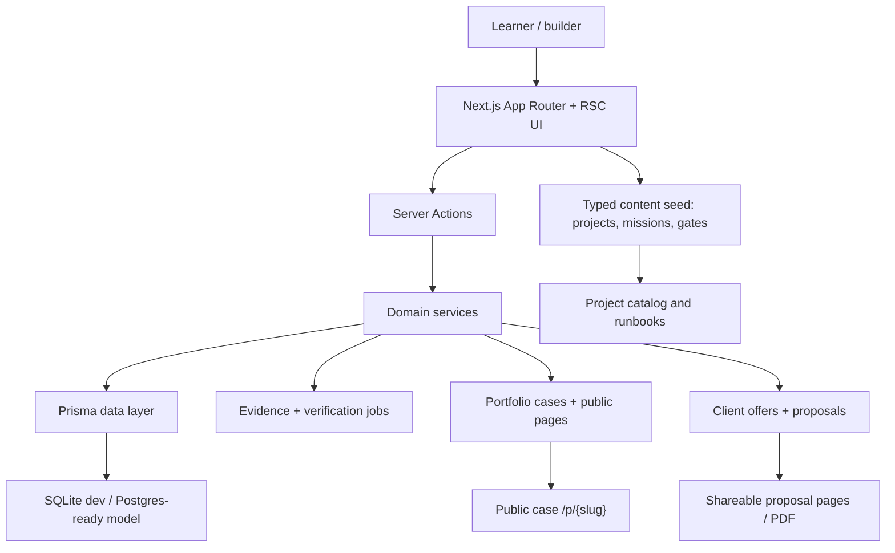

# Forge / Learning OS

**Domain:** EdTech / AI-native learning platform  
**Type:** personal product, private source code  
**Role:** founder, product architect, full-stack engineer, product designer  
**Status:** local/private product, documented as a safe case study

## Summary

Forge is a project-first Learning OS for AI-native builders. It is not a classic video-course platform: the product is built around real projects, evidence, portfolio cases and client-ready outputs.

The core idea is simple: a learner should not only read content, but build products, attach proof, pass quality gates, publish case studies and turn results into client offers.

## Problem

Most learning products measure weak signals: watched lessons, certificates or passive progress. That does not prove whether a person can actually build, ship and explain software.

Forge is designed around stronger signals:

- real project work instead of passive lessons;
- artifacts and evidence instead of vanity progress;
- quality gates instead of vague completion;
- public case studies instead of private notes;
- client offers instead of “course finished” screens.

## Product Surface

The product includes several connected workflows:

- **First Win:** a fast onboarding path that helps a learner publish a first visible result.
- **Project catalog:** 26 project-oriented tracks, including AI systems, Telegram Mini Apps, RAG platforms, dashboards, automation tools and portfolio engines.
- **Workspace:** project progress, missions, artifacts, quality gates and evidence.
- **Evidence engine:** per-gate proof, verification levels, readiness calculation and audit trail for checks.
- **Portfolio engine:** public pages, case builder, Markdown/PDF export and OG generation.
- **Client module:** niche-based offer builder, outreach workflow and proposal generation.
- **Admin/source radar:** content management, seed import concepts and source freshness tracking.

## Stack

- **Frontend:** Next.js 15 App Router, React 19, TypeScript strict, Tailwind CSS, shadcn/Radix UI, Framer Motion
- **Backend:** Next.js Server Actions, Prisma, service-layer architecture
- **Auth:** Auth.js with email/OAuth-ready flow
- **Data:** SQLite for local development, Prisma schema designed for Postgres/libSQL migration
- **Validation:** Zod at data boundaries and content parsing
- **Content system:** JSON seed, typed loaders, project/lesson/gate schemas
- **Quality:** Vitest, Playwright, axe accessibility checks, typecheck/lint/build workflow
- **Artifacts:** PDF generation, OG image routes, portfolio/case export flow

## Architecture

The architecture is layered intentionally:

- `content` is the source of truth for projects, missions, gates and templates;
- `server/services` contains business logic and keeps server actions thin;
- `server/actions` handle auth scope, validation and mutations;
- `app` composes RSC pages and routes;
- `components` contain reusable UI and domain-specific feature panels;
- Prisma stores user progress, evidence, portfolio pages, client offers, proposals and product events.

## Why This Architecture

Learning platforms can become messy quickly because they mix content, progress, public publishing, analytics, admin tools and business workflows. Forge separates those concerns so each part can evolve without rewriting the whole product.

The most important architectural choices are:

- **Typed content seed:** course/project content is machine-readable, validated and reusable across UI, tests and admin workflows.
- **Evidence-first model:** progress is based on proof, not just clicks or completed lessons.
- **Server-side domain logic:** mutations are auth-scoped and go through services instead of pushing business rules into UI components.
- **Additive data model:** the schema is built so features like verification jobs, portfolio cases and client proposals can be added without breaking earlier flows.
- **Local-first development:** SQLite keeps iteration fast, while Prisma keeps the path open for Postgres/libSQL in production.
- **Public-result loop:** portfolio pages, PDF export and proposal flows make the learning result visible and business-relevant.

## Quality Signals

- Strict TypeScript project structure.
- Zod validation on content and server boundaries.
- Prisma schema with explicit relations, unique keys and indexes.
- Unit tests for content, evidence, analytics, readiness, recommendations and proposal logic.
- Playwright-based e2e/visual workflow documented in the progress journal.
- Accessibility checks through axe in the testing strategy.
- Clear progress journal with implementation slices, commits and verification notes.
- Product architecture documented through a detailed master plan and implementation backlog.

## Safe Publication Notes

The local workspace should not be pushed to GitHub as-is. It contains development-only files and unrelated/reference material, including `.env`, `.env.local`, `prisma/dev.db`, build output, screenshots/PDF artifacts and an external learning repository cloned inside the folder.

The safe private-repository path is:

- create a clean repository from `vibe-course-platform/`, not the whole `Обучение/` folder;
- exclude `.env`, `.env.local`, local DB files, `.next`, `node_modules`, test output and unrelated external repositories;
- keep only sanitized screenshots if they contain no private data;
- add a polished README, architecture section and setup instructions;
- keep the repository private unless a separate public/demo version is created later.

---

# Русская версия

## Что это за проект

**Forge / Обучение** — мой личный продукт: Learning OS для людей, которые учатся строить реальные продукты с AI. Это не обычная LMS и не “курс с уроками”. Идея проекта в том, чтобы пользователь не просто смотрел материалы, а проходил путь от первого результата до портфолио и клиентского предложения.

Платформа строится вокруг принципа: навык должен доказываться артефактами. Поэтому внутри есть проекты, миссии, quality gates, evidence, публичные кейсы, portfolio engine и client-offer workflow.

## Какую проблему решает

У большинства образовательных продуктов слабая метрика успеха: человек посмотрел урок, получил сертификат, отметил прогресс. Но это почти ничего не говорит о том, умеет ли он реально проектировать, писать код, запускать продукт, объяснять решения и продавать результат.

Forge решает эту проблему через evidence-based подход:

- прогресс = реальные артефакты, а не просмотренные уроки;
- каждый проект должен приводить к понятному результату;
- качество оценивается через gates: run, UX, security, tests, architecture, portfolio, client readiness и другие;
- пользователь собирает публичный кейс, который можно показать работодателю или клиенту;
- отдельный модуль помогает превратить проект в коммерческое предложение.

## Что умеет продукт

- **First Win:** быстрый путь к первому публичному результату.
- **Каталог проектов:** 26 проектов, включая AI systems, Telegram Mini Apps, RAG, dashboards, automation, portfolio/case-study engine и другие направления.
- **Workspace:** рабочее пространство проекта с миссиями, артефактами, прогрессом и gates.
- **Evidence engine:** доказательства по каждому gate, уровни верификации, readiness и история проверок.
- **Portfolio engine:** генерация публичных страниц, кейсов, Markdown/PDF экспорта и OG-материалов.
- **Client module:** генерация офферов под ниши, outreach workflow и proposal pages.
- **Admin/source radar:** основа для управления контентом, seed-данными и свежестью источников.

## Стек

- **Frontend:** Next.js 15, App Router, React 19, TypeScript strict, Tailwind CSS, shadcn/Radix UI, Framer Motion
- **Backend:** Next.js Server Actions, сервисный слой, Prisma
- **Auth:** Auth.js, email/OAuth-ready архитектура
- **Data:** SQLite для локальной разработки, Prisma-модель с возможностью миграции на Postgres/libSQL
- **Validation:** Zod на границах данных, контента и server actions
- **Content system:** JSON seed, typed loaders, схемы проектов/миссий/gates
- **Quality:** Vitest, Playwright, axe, typecheck/lint/build workflow
- **Artifacts:** PDF generation, OG routes, export кейсов и proposal flow

## Архитектура и почему она такая

Проект разделён на слои:

- `content` — источник истины для проектов, миссий, gates, артефактов и шаблонов;
- `server/services` — бизнес-логика: progress, evidence, portfolio, clients, proposals, analytics;
- `server/actions` — тонкий слой мутаций: auth scope, Zod validation, вызов сервиса, revalidate;
- `app` — страницы и маршруты на Next.js App Router/RSC;
- `components` — UI primitives и domain-specific feature blocks;
- `prisma` — пользователи, прогресс, evidence, portfolio pages, cases, client offers, proposals, product events.

Такая архитектура выбрана потому, что продукт объединяет сразу несколько сложных контуров: обучение, контент, прогресс, публичные кейсы, клиентские офферы, аналитику и админку. Если смешать всё в UI или в один большой backend-файл, проект быстро станет неподдерживаемым.

Разделение на слои даёт:

- понятные границы ответственности;
- возможность тестировать доменную логику отдельно;
- контролируемые server actions вместо хаотичных мутаций;
- безопасную работу с пользовательскими данными;
- возможность развивать продукт от локального MVP к production-инфраструктуре;
- понятную историю для техлида: это не набор экранов, а системно спроектированная платформа.

## Что этот проект показывает работодателю

Этот кейс хорошо показывает не только frontend/backend, но и product engineering:

- умение проектировать платформу, а не отдельную страницу;
- работу со сложной доменной моделью;
- понимание прогресса, верификации, портфолио и бизнес-результата;
- аккуратную server-side архитектуру;
- строгий TypeScript и validation-first подход;
- умение связывать UX, продуктовую механику, backend, базу данных и тесты;
- founder-style мышление: проект создан не ради “учебного кода”, а как реальный продукт с понятной ценностью.

## Что нельзя публиковать как есть

Локальную папку `Обучение` нельзя просто взять и целиком залить в GitHub. Внутри есть рабочие локальные файлы и лишние материалы:

- `.env` и `.env.local`;
- локальная база `prisma/dev.db`;
- `.next`, `node_modules`, test output;
- screenshots/PDF, которые нужно отдельно проверить;
- внешний обучающий репозиторий, вложенный внутрь рабочей папки.

Правильный формат: сделать отдельный приватный репозиторий из очищенного `vibe-course-platform/`, добавить нормальный README, архитектуру, setup-инструкцию и оставить публично только безопасный case study.
