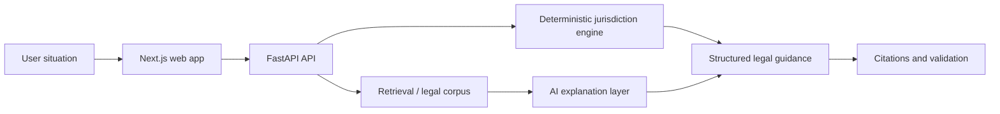

# Klawis

**Domain:** legal-tech AI assistant for Uzbekistan  
**Type:** private/product project  
**Role:** full-stack/product engineering, AI architecture, backend/frontend integration
**Live:** [klawis.uz](https://klawis.uz)
**Status:** deployed product in active development

## Summary

Klawis is a legal AI navigator that helps a user describe a situation and receive a structured legal direction: relevant legal area, likely jurisdiction, court/instance logic, required documents, timelines and references to legal sources.

The project is designed as more than a generic chatbot. It combines deterministic legal routing with AI-assisted explanation and retrieval, so the system can be useful while still staying traceable and citation-oriented.

The product is already deployed and has a roadmap for deeper legal workflows. That matters because Klawis is not only a technical prototype; it is positioned as a real product that can grow into document flows, guided legal scenarios, better source evaluation, user case history and admin/legal review tooling.

## Problem

Legal questions are usually ambiguous for non-lawyers:

- users do not know which legal category their situation belongs to;
- they do not know where to go next: court, authority, documents, deadlines;
- pure LLM answers can sound confident but be hard to verify;
- legal systems require citations, traceability and careful wording.

## Stack

- **Backend:** Python 3.12, FastAPI, Pydantic
- **Frontend:** Next.js, React, TypeScript, Tailwind CSS
- **Data:** Supabase/PostgreSQL, pgvector, Drizzle
- **AI:** OpenAI/Gemini style provider abstraction, RAG, fallback logic
- **Quality:** pytest, Vitest, Playwright-style checks, structured validation
- **Deployment:** Vercel, Render, Supabase

## Architecture

The project is organized as a monorepo with separate areas for API, web app, ingestion, legal engine, evaluation, documentation and infrastructure. Legal routing is separated from the AI explanation layer, which makes the system easier to validate and safer to evolve.

## Why This Architecture

For legal-tech, a plain “LLM answers a question” approach is not enough. The architecture separates:

- deterministic rules for routing and legal classification;
- retrieval/citations for grounding;
- AI generation for user-friendly explanation;
- validation/evaluation for quality control.

This reduces hallucination risk and makes the system more credible for a domain where accuracy and traceability matter.

## What It Demonstrates

- Applied AI beyond prompt engineering
- Product-grade RAG and citation thinking
- Live deployment and active product roadmap
- Full-stack delivery from UI to API and database
- Sensitive-domain UX
- Architecture that balances speed, safety and usefulness

## Roadmap Direction

- richer legal document and next-step flows;
- broader legal knowledge coverage;
- stronger citation/evaluation quality;
- user case history and saved guidance;
- admin/legal review tooling;
- more guided scenarios for common legal problems in Uzbekistan.

## Русское описание

Klawis — задеплоенный legal AI navigator для Узбекистана. Пользователь описывает ситуацию, а система помогает получить структурированное юридическое направление: область права, возможную юрисдикцию, документы, сроки, следующие шаги и объяснение с источниками.

Проект находится в активной разработке. Его ценность не только в AI-интерфейсе, а в архитектуре вокруг юридической точности: deterministic routing, retrieval/citations, structured response, validation/evaluation и аккуратный UX для чувствительного домена.

**Live:** [klawis.uz](https://klawis.uz)

**Почему это сильный кейс:** Klawis показывает applied AI на уровне продукта, а не просто prompt engineering. Здесь есть full-stack delivery, RAG, citation discipline, legal-domain routing, деплой и roadmap развития в сторону document flows, case history, admin/legal review tooling и более глубоких юридических сценариев.
