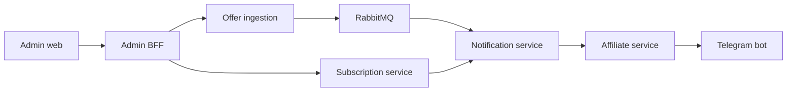

# Marketbot

**Domain:** e-commerce automation / notifications  
**Type:** private backend/product platform  
**Role:** service design, backend architecture, admin workflow, event-driven pipeline

## Summary

Marketbot is a platform for collecting product offers, managing subscriptions, generating affiliate links and sending relevant Telegram notifications to users.

## Problem

Offer-based products need several moving parts:

- ingestion from external product sources;
- normalized storage;
- user subscriptions and filters;
- notification delivery;
- admin visibility into failures and state;
- affiliate link generation.

Putting everything into one uncontrolled script would make the system hard to debug and evolve.

## Stack

- **Backend:** Python 3.12, uv workspace
- **Contracts:** gRPC/protobuf
- **Messaging:** RabbitMQ
- **Data:** PostgreSQL per service, Redis
- **Admin:** React, Vite, TypeScript, TanStack Query, Zod
- **Infra:** Docker Compose, Traefik
- **Quality:** pytest, Vitest, buf

## Architecture

The platform is split into domain services: subscription, offer ingestion, notification, affiliate, Telegram bot and admin BFF. Services communicate through gRPC contracts and async events.

## Why This Architecture

Ingestion, subscriptions, notifications and affiliate logic change for different reasons. Separating them reduces coupling and makes failures easier to isolate. RabbitMQ fits the event-driven nature of offer updates and notifications.

## What It Demonstrates

- Microservice-style backend design
- Event-driven architecture
- Admin panel and operational workflows
- gRPC/protobuf contracts
- E-commerce automation and Telegram delivery
