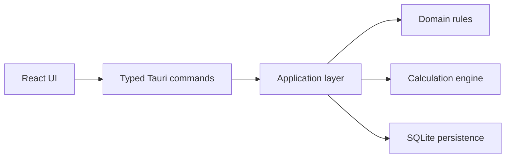

# med-exe

**Domain:** health-tech / desktop software  
**Type:** private clinical/research desktop project  
**Role:** desktop architecture, Rust domain modeling, frontend integration, offline-first product design

## Summary

med-exe is an offline Windows desktop application for cardiometabolic risk calculation and patient profile management. It is designed to run locally without sending sensitive medical context to a remote server.

## Problem

Clinical/research tools need to be deterministic, reproducible and privacy-aware. A web-only architecture can be inappropriate when data should stay local or when the tool must work without a backend.

## Stack

- **Desktop:** Tauri 2
- **Core:** Rust workspace
- **Frontend:** React, TypeScript, Vite
- **Storage:** SQLite
- **Validation:** Zod/typed boundaries
- **Quality:** Rust tests, clippy, rustfmt, frontend tests/typecheck

## Architecture

Rust code is separated into domain, calculation engine, application and persistence crates. The UI communicates through typed commands and does not directly own the medical calculation logic.

## Why This Architecture

The calculation logic must be stable and testable. Separating UI from the Rust domain engine reduces the risk that interface changes accidentally affect medical logic. Tauri was chosen to provide a desktop app without the heavier runtime profile of Electron.

## What It Demonstrates

- Offline-first desktop product architecture
- Rust for reliable domain logic
- Sensitive data awareness
- Deterministic calculation design
- Clean boundary between UI and core engine
