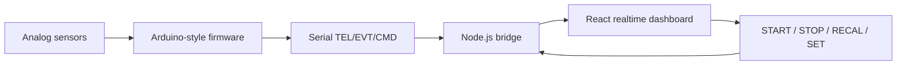

# Sentinel Edge / smart-system

**Domain:** embedded / IoT / local monitoring 
**Type:** public project repository 
**Role:** firmware architecture, serial protocol design, bridge/dashboard integration, product documentation 
**Repository:** [sentinel-edge-smart-system](https://github.com/SamandarMansurkhodjaev2713/sentinel-edge-smart-system)

## Summary

Sentinel Edge is a local-only smart environment monitoring prototype built around Arduino-style firmware, a Node.js serial bridge and a React/Vite operator dashboard.

The system observes ambient light, sound envelope and temperature, learns a local baseline, detects sustained context changes, emits explainable telemetry/events and visualizes the device state in a realtime dashboard.

## Problem

Many embedded demos stop at raw sensor values. Sentinel Edge goes further: it uses adaptive baselines, anomaly scoring, a deterministic finite-state machine, explainable event records and a real operator console.

The goal is not to claim heavyweight AI. The goal is honest edge intelligence: local baseline-relative detection with dwell, hysteresis and explainable channel contributions.

## Stack

- **Firmware:** Arduino-style C++ for UNO-class devices
- **Protocol:** compact serial frames: `TEL`, `EVT`, `CMD`
- **Bridge:** Node.js, `serialport`, `ws`
- **Dashboard:** React 19, Vite, TypeScript, Tailwind, Framer Motion, Zustand, uPlot
- **Documentation:** PRD, system architecture, hardware design, QA and demo deployment docs

## Architecture

The firmware is split into modules for sensors, signal processing, baseline modeling, anomaly scoring, state machine, decisions, outputs, explanation and protocol. The bridge keeps hardware access outside the browser and exposes localhost WebSocket messages to the dashboard.

## Why This Architecture

The architecture is intentionally simple but disciplined:

- firmware stays deterministic and non-blocking;
- serial frames stay compact and MCU-friendly;
- the bridge isolates serial transport from UI state;
- the dashboard can focus on realtime visualization, diagnostics and controls;
- documentation makes hardware, safety and demo boundaries explicit.

## What It Demonstrates

- Embedded thinking under UNO-style constraints
- Serial protocol design
- Realtime dashboard architecture
- Local-first monitoring without cloud dependency
- Clear documentation for hardware, QA and deployment

## Русское описание

Sentinel Edge / smart-system — публичный проект на стыке embedded и full-stack: Arduino-style прошивка, serial protocol, Node.js bridge и React/Vite dashboard.

Проект показывает, что система может быть “умной” без фейкового AI: она строит локальную норму среды, считает отклонения, применяет dwell/hysteresis, ведёт FSM-состояния и объясняет события через вклад каналов.

**Почему это сильный кейс:** он показывает не только веб-разработку, но и работу с железом, прошивкой, протоколом, realtime UI, диагностикой и документацией. Для работодателя это сигнал широты: я могу соединять hardware, backend bridge и frontend console в одну понятную систему.
