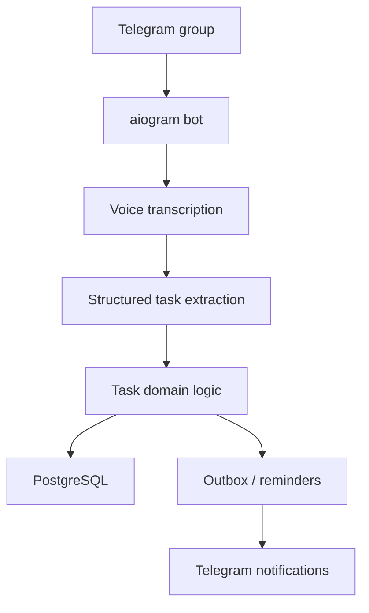

# Task Manage Bot

**Domain:** Telegram automation / operations  
**Type:** private automation project  
**Role:** backend architecture, bot workflow design, AI transcription integration, reliability patterns

## Summary

Task Manage Bot is a Telegram group bot for turning voice messages and chat activity into structured tasks, reminders and operational workflows.

The project is built as a production-style automation system rather than a simple command bot.

## Problem

Teams often create tasks informally in chats and voice messages. Important work gets lost because there is no structured assignment, deadline, reminder or review loop.

The bot solves this by extracting tasks from natural communication and turning them into trackable workflow items.

## Stack

- **Language:** Python 3.12
- **Bot:** aiogram 3
- **AI:** OpenAI transcription and structured output flow
- **Data:** PostgreSQL, SQLAlchemy async, Alembic
- **Reliability:** retries, idempotency, queue/outbox patterns
- **Quality:** pytest, mypy, ruff, bandit-style checks, structured logging
- **Infra:** Docker Compose

## Architecture

The project uses a clean modular structure with domain, application and infrastructure layers. Slow or failure-prone operations are handled through queues/outbox/retry logic, so the bot can remain responsive while still processing reminders and follow-ups reliably.

## Why This Architecture

Telegram bots are easy to prototype but hard to make reliable. This architecture focuses on:

- idempotent handling of messages;
- safe retries for external APIs;
- clear task domain logic;
- background reminders;
- structured logging and testable use cases.

## What It Demonstrates

- AI automation inside a practical workflow
- Telegram bot architecture beyond simple commands
- Async Python and database design
- Reliability thinking: queues, retries, idempotency
- Product thinking for team operations
