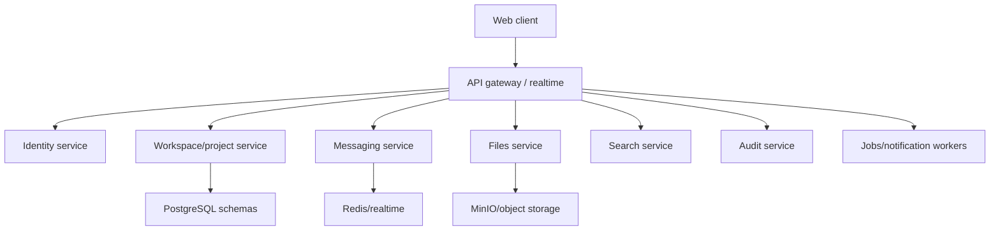

# TTYL Platform

**Domain:** enterprise collaboration / on-prem productivity  
**Type:** private product platform  
**Role:** full-stack architecture, backend systems, product design, deployment planning

## Summary

TTYL Platform is a self-hosted collaboration platform for teams that need project management, chat, files, search, notifications and auditability in one controlled environment.

The product direction is close to replacing a stack like Jira + Slack + file storage for organizations that prefer on-premise deployment and stronger control over their data.

## Problem

Many teams need collaboration tools, but not every organization wants to send internal work, files and communication to external SaaS providers. The challenge is to provide modern UX while keeping deployment, storage, permissions and audit logs under control.

## Stack

- **Backend:** TypeScript, NestJS, Fastify, Prisma
- **Frontend:** Next.js, React, TypeScript, Tailwind, Radix UI, TanStack tools
- **Data:** PostgreSQL, Redis
- **Files:** MinIO, ClamAV-style scanning boundary
- **Async:** BullMQ/workers, realtime gateway, WebSocket
- **Infra:** Docker, Nginx, OpenTelemetry/Prometheus/Grafana/Loki/Tempo style observability
- **Monorepo:** pnpm workspaces, Turborepo

## Architecture

The system is split by domains: identity, workspace/project management, messaging, files, search, notifications, audit and realtime. It uses clear service boundaries and shared contracts instead of mixing all workflows into a single unstructured backend.

## Why This Architecture

The main reason is operational clarity. Collaboration platforms contain very different types of complexity:

- permissions and identity;
- realtime messaging;
- project/task workflows;
- file storage and scanning;
- search;
- notifications;
- audit trails.

Keeping these boundaries separate makes the platform easier to secure, test, deploy and scale. It also supports an on-premise story because infrastructure dependencies are explicit.

## What It Demonstrates

- Enterprise full-stack architecture
- On-premise and privacy-aware product thinking
- Realtime, files, queues and audit logs
- Service boundaries and typed contracts
- Ability to design a product platform, not only a single feature
