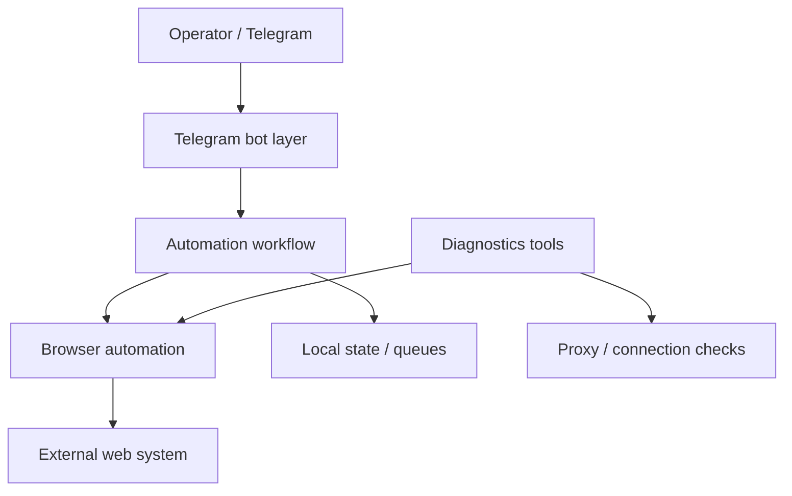

# VFS Killer Main

**Domain:** browser automation / external workflow automation  
**Type:** private automation system  
**Role:** automation architecture, crawler/bot workflow, diagnostics, deployment containerization

## Summary

VFS Killer Main is a private automation project for a high-friction external web workflow. It combines browser automation, crawler logic, account/proxy configuration boundaries, Telegram bot control and diagnostics tooling.

The repository is private because it can contain sensitive operational configuration, account data, proxy settings, browser traces and environment files. This public case study does not include those details.

## Problem

Some external web workflows are slow, unstable and difficult to automate:

- dynamic browser behavior;
- anti-automation friction;
- session and account state;
- proxy/network variability;
- timing-sensitive actions;
- need for operator control and alerts.

A single script is not enough for this type of system. It needs a more controlled architecture with separated crawler logic, bot interface, diagnostics and deployment boundaries.

## Stack

- **Language:** Python
- **Browser automation:** Playwright/Camoufox-style browser control
- **Bot layer:** aiogram / Telegram bot workflows
- **Data/config:** local configuration files, SQLite/structured state where needed
- **Infra:** Docker, Docker Compose
- **Diagnostics:** browser endpoint checks, proxy checks, connection tests, parsing tests

## Architecture

The system separates the operator interface from the browser automation layer. Diagnostics are kept as first-class tools because browser-based automation often fails due to external state, network conditions or timing issues rather than pure code errors.

## Why This Architecture

The architecture is designed for unstable real-world automation. Browser workflows need observability and recovery paths. Separating the bot, crawler, diagnostics and configuration makes it easier to test, run in Docker, debug failures and avoid turning the project into one fragile script.

## What It Demonstrates

- Browser automation under real-world constraints
- Telegram-controlled operational workflows
- Dockerized automation runtime
- Diagnostics-first engineering mindset
- Handling of timing, retries, external-state failures and network variability
- Privacy-aware presentation of sensitive automation work

## Русское описание

VFS Killer Main — приватная система автоматизации сложного внешнего web-workflow. Проект объединяет browser automation, crawler-логику, Telegram bot управление, Docker-запуск и набор diagnostic tools.

Смысл проекта не в том, чтобы “написать парсер”, а в том, чтобы построить управляемую automation-систему для нестабильной внешней среды: браузер, сессии, сеть, прокси, тайминги, проверки соединения, ручное управление через бота и диагностика проблем.

**Почему это выглядит сильно для работодателя:** проект показывает умение автоматизировать сложные реальные процессы, где важны не только код и селекторы, но и устойчивость, диагностика, retry-мышление, контейнеризация и аккуратная работа с чувствительными данными.
